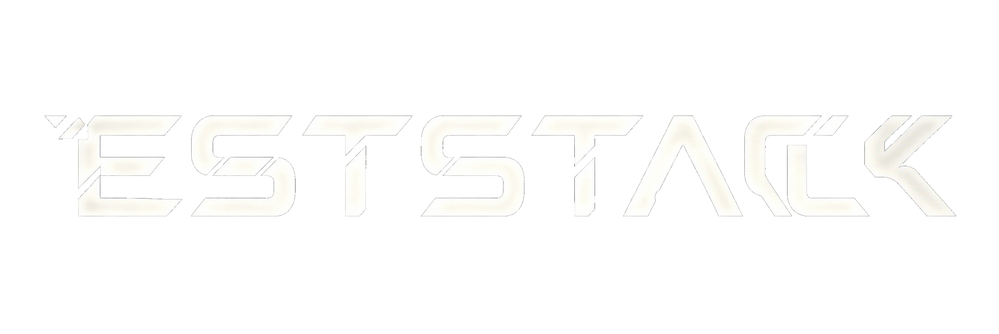

$\mathscr{Model,\ Match,\ Estimate\ In\ Stack.}$

## Introduction

It's a significant problem to let robots know where they are at real-time — from the rotation puzzle of Wahba's problem to the ceaseless pursuit of motion tracking, and onward to the intricate odyssey of probabilistic state propagation.

This repository is an ongoing endeavor to distill those geometric riddles and statistical tensions into clean, composable layers of code. This project has three layers, just like its name: `Problem`, `Model` and `Solution`. The general pipeline we handle estimation problem is: we meet an estimation problem, we build "proper" model for it and we calculate this model parameters via appropriate solution. Thanks to multi-stack design, we can handle different state estimation problems via appropriate combination.

Just stay tuned.

> [!WARNING]
> this repository is far from "enable to use", some derivation might be wrong, raise an issue if you find, that will mean a lot for me! :>