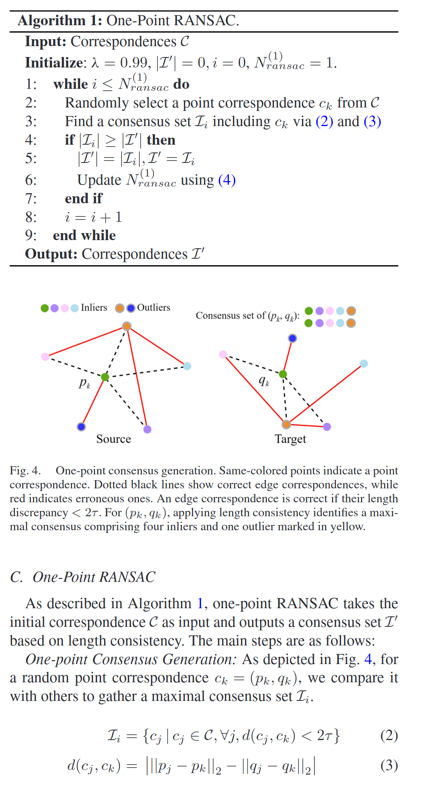
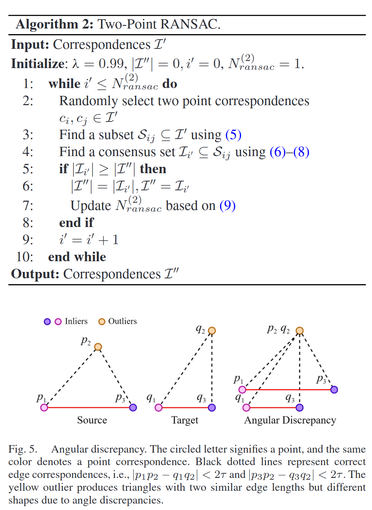
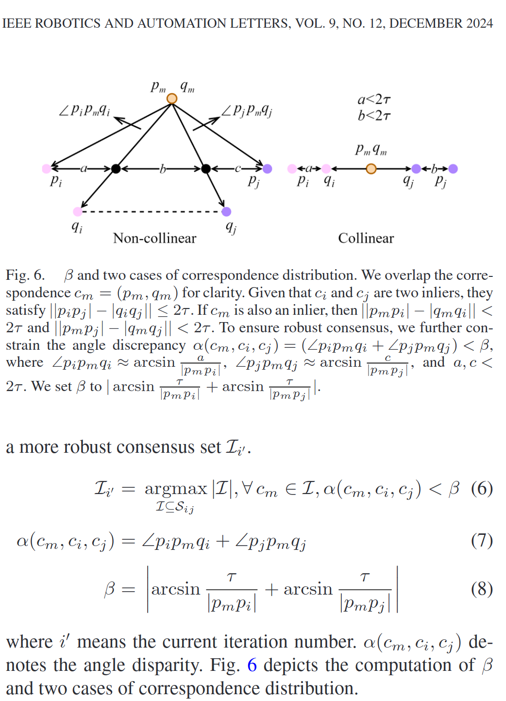
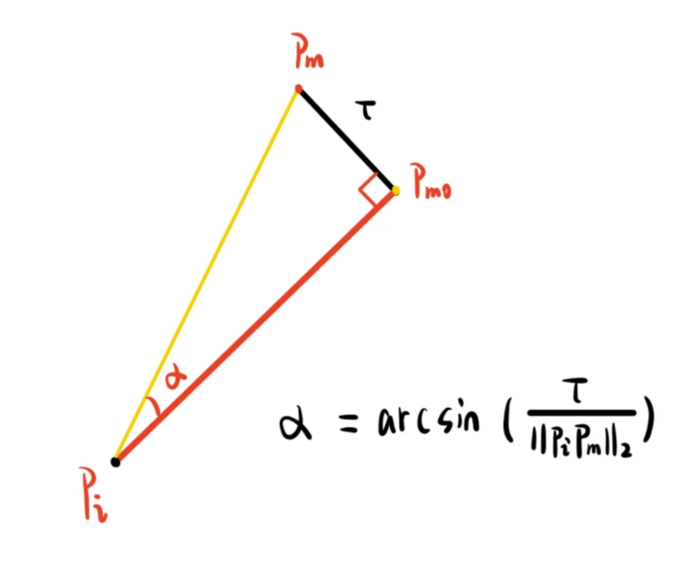
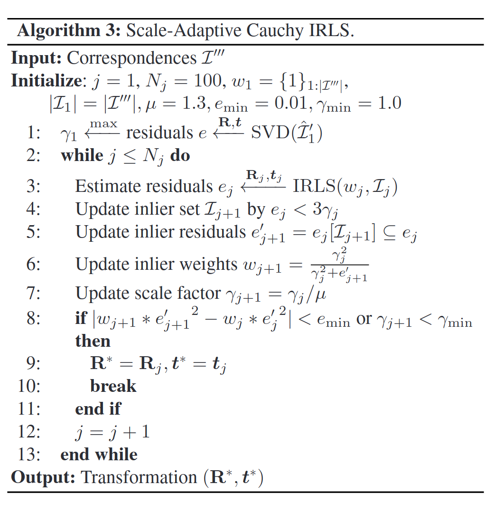
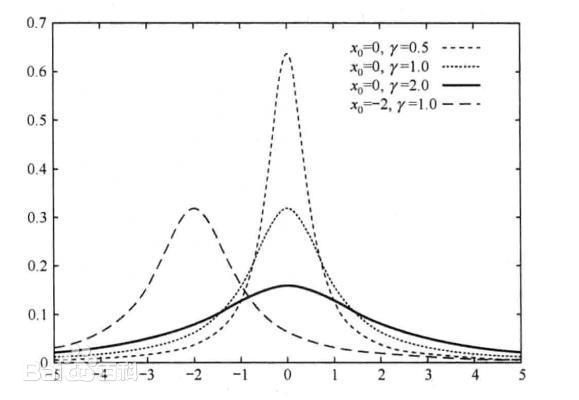

# TCF Explanation

## Paper Explanation

| 标题翻译 |                                                                                                                                                                                                                                                                                                                                                                                                                                                |
| -------- | ---------------------------------------------------------------------------------------------------------------------------------------------------------------------------------------------------------------------------------------------------------------------------------------------------------------------------------------------------------------------------------------------------------------------------------------------- |
| 作者     | Pengcheng Shi; Shaocheng Yan; Yilin Xiao; Xinyi Liu; Yongjun Zhang; Jiayuan Li                                                                                                                                                                                                                                                                                                                                                                 |
| 出版年份 | 12/2024                                                                                                                                                                                                                                                                                                                                                                                                                                        |
| 期刊     | IEEE Robotics and Automation Letters                                                                                                                                                                                                                                                                                                                                                                                                           |
| 期刊等级 | <span style="color: rgb(111, 69, 135);"><span style="background-color: rgb(232, 222, 238);">ㅤㅤ ㅤㅤIF 5.3 ㅤㅤ ㅤㅤ</span></span> ㅤㅤ ㅤㅤ<span style="color: rgb(204, 31, 0);"><span style="background-color: rgb(255, 226, 221);"> ㅤㅤ ㅤㅤSCI Q1 ㅤㅤ ㅤㅤ</span></span> ㅤㅤ ㅤㅤ<span style="color: rgb(111, 69, 135);"><span style="background-color: rgb(232, 222, 238);"> ㅤㅤ ㅤㅤSCI升级版 计算机科学2区 ㅤㅤ ㅤㅤ</span></span> |

***

### One-Stage SAC Model



第一个RANSAC很简单， model就是满足式(3)的点集，式(3)就是在约束尺度变化量，找一对锚correspondence，然后比较各自与其他点的长度，足够小的就放进consensus set，注意这个式子是通过三角形边长不等式推导得到的。作者并没有说$\tau$是怎么算出来的，尽管他说可以automatically adjust，需要看代码。

### Two-Stage SAC Model





第二个RANSAC的model是在第一consensus set的基础上找满足式(6)-式(8)的点集，首先找俩对锚correspondence，通过角度约束得到第二个consensus set，需要注意的在最坏情况下——也就是就是第二张图中观测的$p_m$和$q_m$同时到达最大偏离角度时，若设他们的真值是$p_{m0}$和$q_{m0}$，则易得$p_m$和$q_m$分别落在以$p_m$和$q_m$为圆心，$\tau$为半径的圆上，最大偏离点$p_{m\max}(q_{m\max})$在垂直于$p_ip_{m0}(q_iq_{m0})$横移$\tau$处，如下图所示。那么可以根据正弦定理快速得到其最大偏离角度，两者的偏离角度一相加就是总的角度一致性阈值$\beta$。



### Three-Stage SAC Model + IRLS

第三个RANSAC就是Kabsch，没啥好讲的，需要注意的是，他可以直接用在algorithm 3的初始化（下图式1）。



#### Step 1
通过Kabsch得到初始变换，然后计算得到各correspondence的residual，选个最大的当作初始scale，后文会提到这个叫Cauchy分布的尺度参数。intialize里的w\_1是1，这代表是L2-norm，即所有点一视同仁，无权重。

#### Step 3&4
通过IRLS得到带权重的最小二乘解，具体原理看：<https://sepwww.stanford.edu/data/media/public/docs/sep115/jun1/paper_html/node2.html>，根据得到的解算出估计的最小residual，丢进Cauchy分布里面，如果residual在$3\gamma$（这个“3”可用于估计器的一致性判断，这里应该是个经验值）范围里面（$\gamma$正是Cauchy分布的尺度参数，见下图），那就认为是内点。



#### Step 5&6
选这个内点residual，通过Cauchy Loss更新权重，注意big residual mostly outlier, small residual mostly inliner，这句话你可以看Cauchy Loss的表达式自己悟出来。注意Cauchy Loss会比Huber Loss对big outlier更不敏感，从而更好剔除，具体可以看看step3&4提到的网址。

#### Step 7
scale通过除以衰减因子$\mu$一步一步缩小，直到找到最佳变换，有点像吃鸡里面的“缩毒圈”:>

#### Step 8
进行收敛判断：两个条件满足一个就结束收敛：（1）加权residual平方差小于$\mathbf{e}_{\text{min}}$，其中e\_j就是上一次的估计residual。这个$\mathbf{e}_{\text{min}}$按AI的说法是最小能量阈值，我的理解就是residual的变化量小到一定程度以至于梯度最小，那么就是收敛了。（2）scale比1小。从上图来看，scale到1的内点范围已经很小了，再小就退化成冲激函数（数学里叫Kronecker函数）了！

***

个人观点：感觉可以优化的点在于Kabsch、衰减因子$\mu$和最小能量阈值$\mathbf{e}_{\text{min}}$

## Code Explanation

source code refer to [TCF github](https://github.com/ShiPC-AI/TCF).

### One-Stage SAC Model

While I read the paper, I found this words:

> Our method automatically adjusts the noise bounds as the noise level increases, ensuring the inliers continue to meet the criteria. Thus, it remains effective despite higher noise.

there's nothing further in paper but in source code:

```C++
Matf3D src = inliers.topRows(3);
Matf3D dst = inliers.bottomRows(3);

Eigen::MatrixXf src_dist_matrix(src.cols(), src.cols());
Eigen::MatrixXf dst_dist_matrix(dst.cols(), dst.cols());
computeDistanceMatrix(src, src_dist_matrix);
computeDistanceMatrix(dst, dst_dist_matrix);
Eigen::MatrixXf Z = (src_dist_matrix - dst_dist_matrix)array().abs();
Eigen::MatrixXi F = (Z.array() < t2).cast<int>();
inlier_size = std::ceil(std::sqrt(F.sum()));

Mati1D F_colwise_sum = F.colwise().sum();
std::vector<int> sorted_column_indices_total;
sortRowVectorDescending(F_colwise_sum, sorted_column_indices_total);
```

obviously, I could not figure it out at the first glance since I never learnt graph theory at all, even did not know this thing lays on field of graph theory. so I just call AI to explain, as it says:

> 1. 把点变成"朋友关系"
> 你有一堆候选点，怀疑其中一些是真内点，一些是外点。
> 规则：如果两个点之间的"边长一致性"成立（Z < 2t），就称它们是朋友。
> 2. F 就是"朋友关系表"
> F 是一个方阵：
> - F(i, j) = 1：点 i 和点 j 是朋友
> - F(i, j) = 0：不是朋友
> 因为任何点和它自己总是朋友（距离差为 0），所以对角线全是 1。
> 3. 真内点形成了一个"小圈子"
> 刚体变换保持点间距离不变。所以：
> - 真内点之间：任意两个都是朋友 → 它们形成了一个完全连接的密集小圈子
> - 外点：它和大多数人的距离关系是乱的，所以朋友很少
> 你不需要会图论，只需要懂这个画面：真内点互相都是朋友，外点基本没朋友。
> 4. 怎么估计"小圈子有多少人"
> 如果小圈子里有 k 个人，每个人和其余 k-1
> 个人都是朋友，再加上自己和自己是朋友：
> - 小圈子里总共有大约 k × k 个 1
> 严格说应该是 k²，因为 $k$ 个人每人有 $k$ 个朋友包括自己）
> 而外点贡献的 1 很少，基本可以忽略。
> 所以：
> $$\text{F 中 1 的总数} \approx k^2$$
> 反过来：
> $$k \approx \sqrt{\text{F 中 1 的总数}}$$
> 这就是`sqrt(F.sum())`的直觉——它在快速估算真内点有多少人。
> 5. 排序是干什么的
> F 的列和表示：某个点一共有多少个朋友。
> - 真内点：朋友多（因为在小圈子里）
> - 外点：朋友少
> 按"朋友数量"从高到低排序，取前 k 个，就是最可能是真内点的那批人。

very easy to understand, isn't it?
