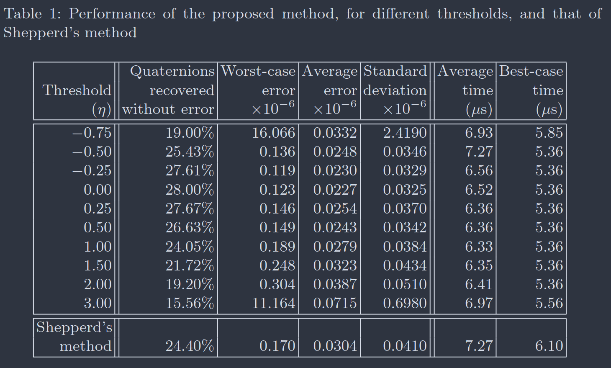
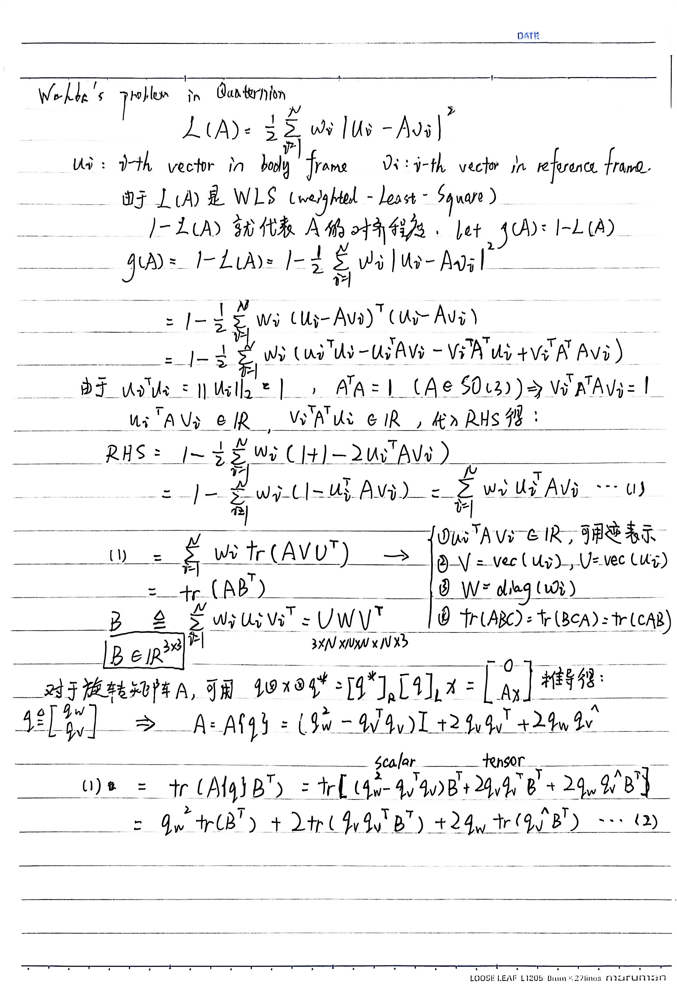
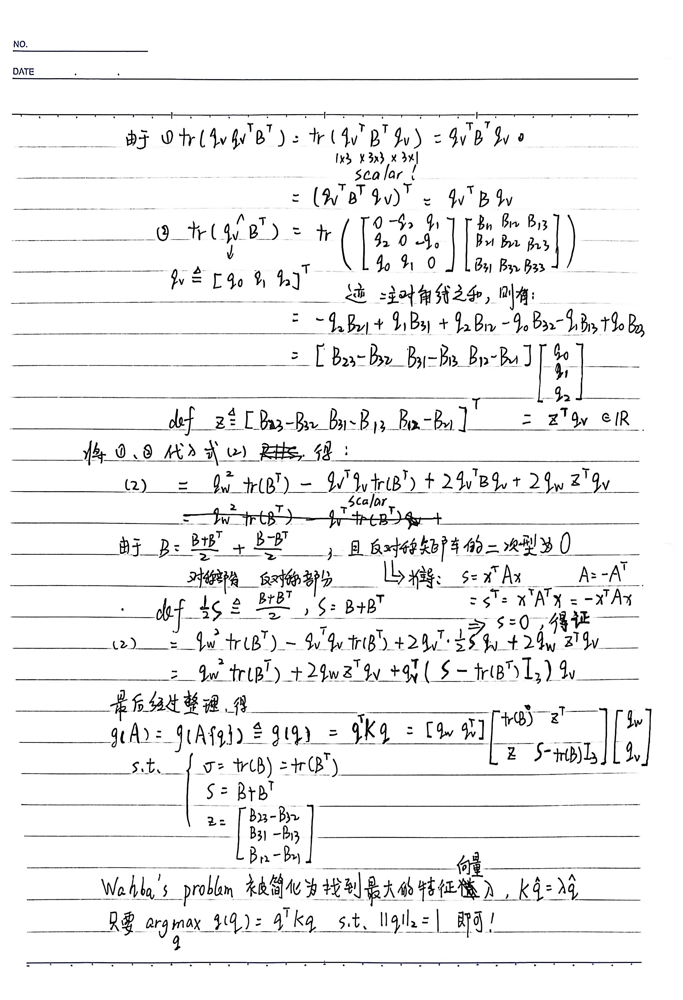

# DCM to Quaternion Explanation

## Quaternion Convention

paper[14] use JPL quaternion, but `Eigen` and `manif` prefer Hamilton quaternion, also matrix $\mathbf{K}$ have different definition between [14] and [13]. $\mathbf{K} = \begin{bmatrix}
\mathbf{\sigma} & \mathbf{z}^{\top} \\
\mathbf{z} & \mathbf{S}-\mathbf{\sigma I}_3 \\
\end{bmatrix} $ in [13], but [14] is denoted by $\mathbf{K} = \begin{bmatrix}
\mathbf{S}-\mathbf{\sigma I}_3 & \mathbf{z} \\
\mathbf{z}^{\top} & \mathbf{\sigma} \\
\end{bmatrix} $.
**For convenient, we prefer Hamilton quaternion here.**

## A Little Mess About `Eigen::Quaterniond`

`Eigen::Quaterniond` has two commonly used constructors that are easily confused:

| Constructor | Signature                                                                         | Internal Storage                          |
| ----------- | --------------------------------------------------------------------------------- | ----------------------------------------- |
| #2          | `Quaterniond(const Scalar& w, const Scalar& x, const Scalar& y, const Scalar& z)` | `m_coeffs = [x, y, z, w]`                 |
| #7          | `Quaterniond(const Vector4d& vec)`                                                | `m_coeffs = vec` (expects `[x, y, z, w]`) |

**The Trap**: The four-parameter constructor takes **(w, x, y, z)** with the scalar part first, but the `Vector4d` constructor expects **(x, y, z, w)** with the scalar part last.

In DCM to Quaternion conversion, the K matrix eigenvector returns `[qw, qx, qy, qz]` (Hamilton convention, scalar-first). Therefore:

```cpp
// CORRECT: Four-parameter constructor (w, x, y, z)
Eigen::Quaterniond q(q(0), q(1), q(2), q(3));  // q(0)=qw, q(1)=qx, ...

// WRONG: Vector4d constructor expects (x, y, z, w)
Eigen::Quaterniond q(q_vec);  // Would interpret qw as x, qx as y, ...
```

This is why the implementation must use the explicit four-parameter form rather than the seemingly cleaner single-argument construction.

## Sarabandi Performance



As paper[12] said:

> The highest errors are obtained for rotation axes corresponding to points contained in the spherical triangles centered in each octant. Now, if we increase the threshold, these spherical triangles, where the highest errors are obtained, are reduced. For η = 0, they have almost completely disappeared. This gives a visual justification of why the optimal threshold is located at η = 0.

So I set `eta` default as `0.0`, you can change eta via this table.

## Davenport’s q-Method Derivation



