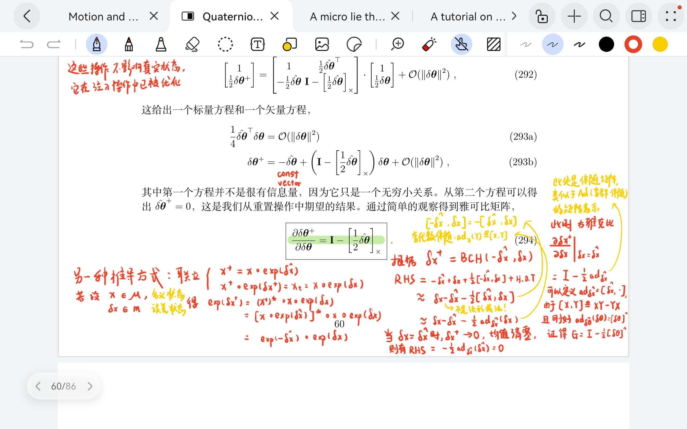

# ESKFOM Explanation

## Reset Jacobian Derivation

we need some tricks about lie bracket $[\cdot,\cdot]$ to derive how small adjoint related to wedge mapping, here provides derivation in $\boldsymbol{SO}(3)$:

**NOTE:** if manifold is $\boldsymbol{SE}(3)$ or $\boldsymbol{SE}_2(3)$, the skew-symmetric matrix would not equal to small adjoint matrix since $(\cdot)^{\wedge}: \mathbb{R}^{n} \to \mathbb{R}^{m\times m}$, but $ \boldsymbol{ad}_{(\cdot)}: \mathbb{R}^n \to \mathbb{R}^{n\times n}$, here we define $m$ is dimension of lie group (`manif::Dim`) and $n$ is dimension of lie algebra (`manif::DoF`).